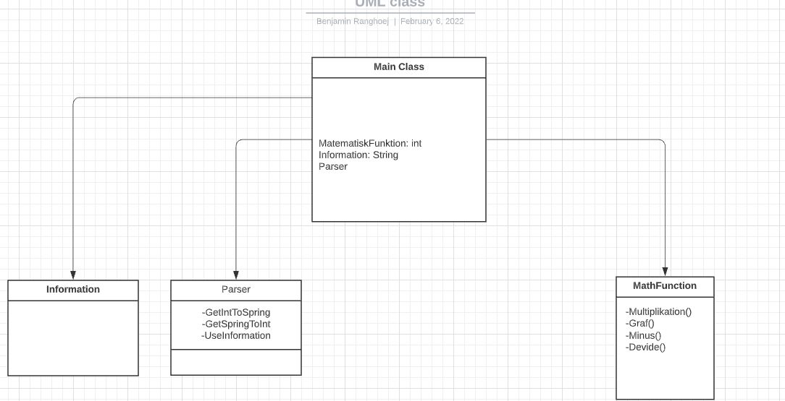
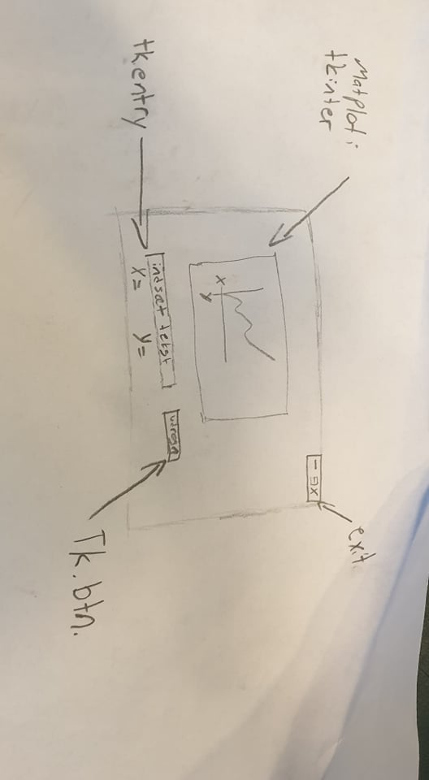
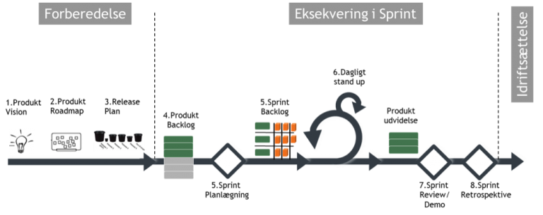

# Projekt-infrastrukturering

Her har vi vores [trello](https://trello.com/invite/b/JtIuVgjM/ae43df11d05710eb05ca86b42af3164e/projekt) 

Link til [tkinter](https://www.foxinfotech.in/2018/09/how-to-create-window-in-python-using-tkinter.html) hjemmeside 

Link til inspiration [Plot](https://www.geeksforgeeks.org/how-to-embed-matplotlib-charts-in-tkinter-gui/)

vores synopsis viad [docs](https://docs.google.com/document/d/11HQmjYZEANnnKT7QOxXoVZlYtD3QBqFkWux2yL68lo0/edit?usp=sharing)

dette er en af vores første GUI skitser

her er scrum modellen som vi kommer vi bruger til infrastrukurerings metode

